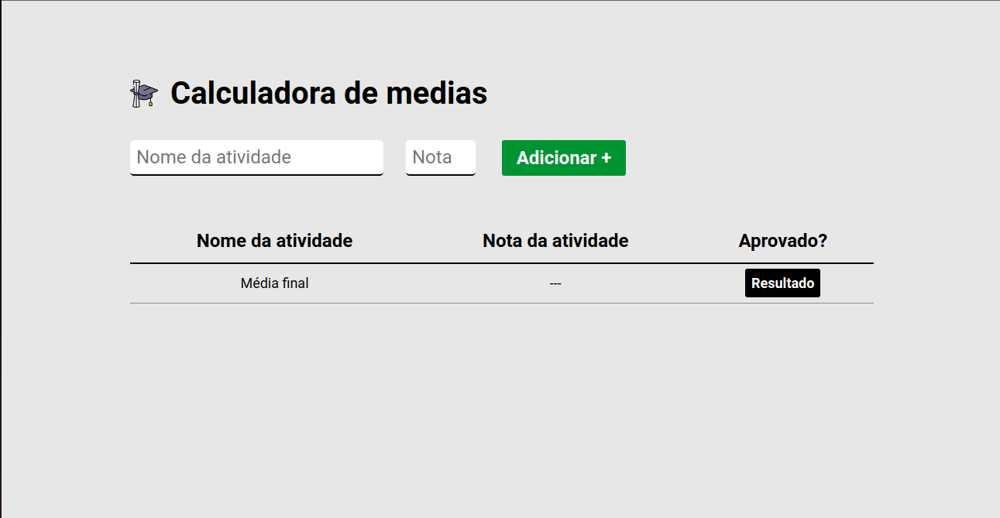
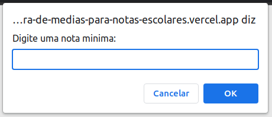
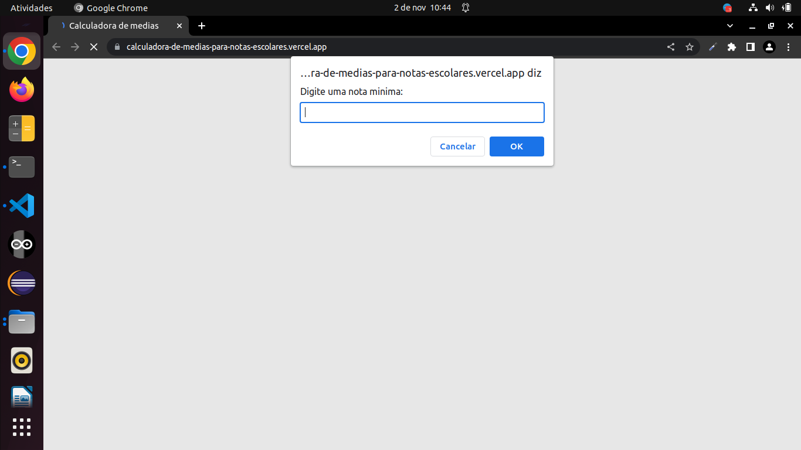
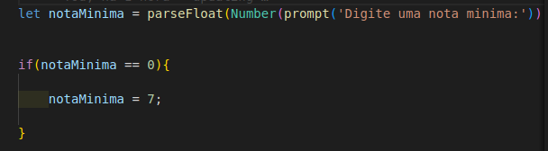
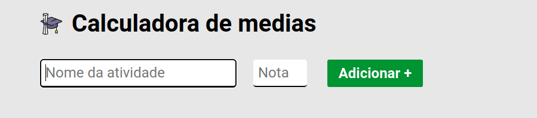
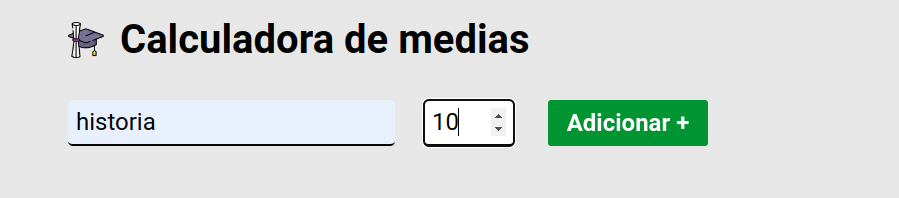
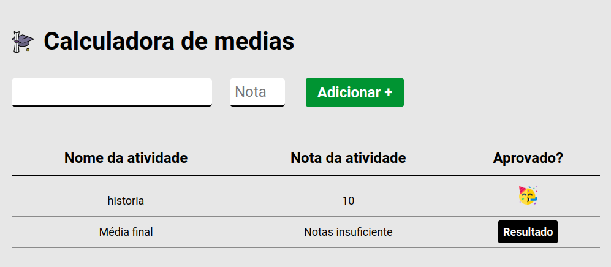
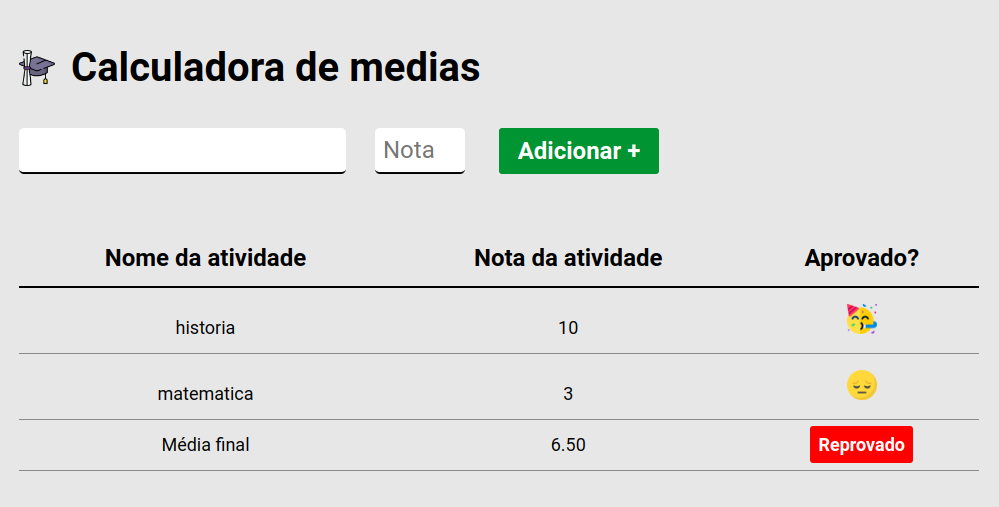

# Calculadora de medias
### Licença vinculada ao repositório: 

#
### Descrevendo o projeto :
#### Tecnologias : 

 
    
    
    

#### Essa aplicação web foi feita para calcular a media de notas , abaixo podemos ver a aplicação completa.

# 
### Como a aplicação funciona ?
- Quando  abrimos o link,  vamos ver uma tela pequena no topo da pagina:
    - Nessa tela devemos digitar o valor minimo para pasarmos na media final:
    - caso o valor digitado seja 0 ou nulo a aplicação vai selecionar o valor 7 como escolha padrão:
- Apos escolher a nota minima, vamos ir para tela principal:
    - Vamos ter dois campos de inputs, um para entrada do nome da atividade e o outro para entrada do valor da nota:
    - Apos preencher clique em adicionar:
        - Ao clicar em adicionar vemos algumas mudanças na pagina, como por exemplo a adição de mais uma linha contendo o nome da atividade e sua nota. O campo de input fica limpo apos clicar no adicionar:  
        - OBS: apos adicionar somente uma nota , nos podemos comcluir que somente uma é um valor baixo para calcular a media final, portanto  para que a linha da média final mude  devemos adicionar duas ou mais notas de atividades. Com base na media dada no inicio teremos o resultado de aprovado ou reprovado no canto direto inferior.

#
### <a href="https://calculadora-de-medias-para-notas-escolares.vercel.app/">Para ver o site clique aqui!</a>